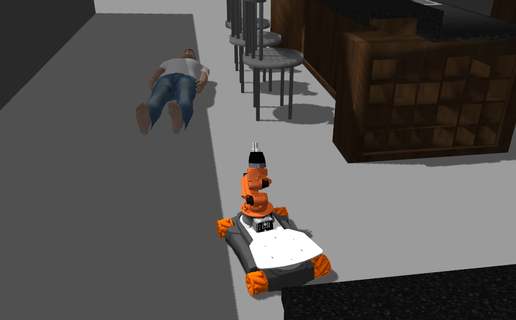
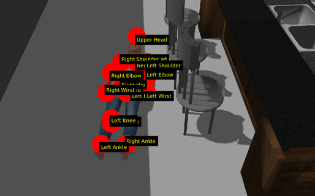
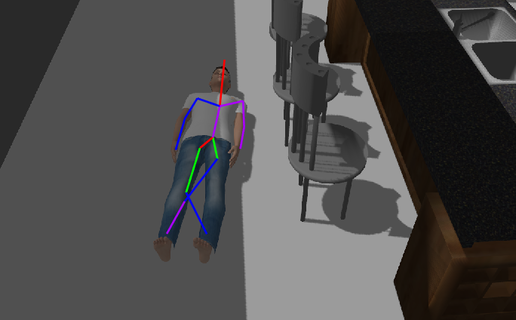
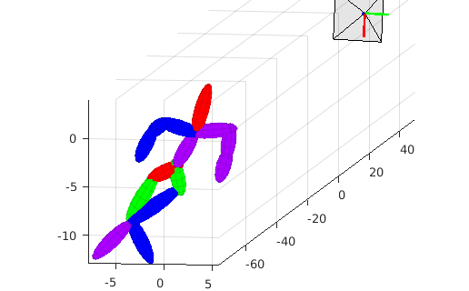

# SOS-VR-Victim-Detection-and-Pose-Estimation
Victim detection and 3D pose estimation from 2D iamges for a rescue robot
<h3>Victim Detection and 3D Pose Estimation from 2D Images for a Rescue Robot</h3>

    

        
	
    

    

	
	
    

2 phase Victim Detection and 3D pose estimation system implemented for a rescue robot. 
- In the first stage an Object Detection method used to detect the lying-down human bodies(victims).   
- In second stage a CNN algorithm is used to find body joints information then this joints are used to reconstruct a 3D model of human body and camera pose by applying matching pursuit algorithm in order to estimate the sparse representation of 3D pose and the relative camera from only 2D image evidence.
 
 This Project is going to be submmited as: M. TaherAhmadi, S. Azami, S. Shiry, ”2 Stage Victim Detection and Pose Estimation from 2D Images for a Rescue Robot” In Intelligent Robots and Systems, IROS. IEEE/RSJ International Conference. IEEE, 2017.
 Alpha version of Codes are avilable but final version and results will be published soon [<a href="https://github.com/Taherahmadi">github</a>].

